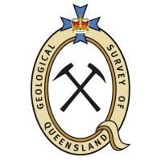

  

# GSQ Geological Administrative Features Ontology
This ontology defines a series of subclasses of the [GeoSPARQL Ontology's](https://www.opengeospatial.org/standards/geosparql) `Feature` class that are used by the [Geological Survey of Queensland](https://linked.data.gov.au/org/gsq) to admininster geologically-based resource extraction in the Australian state of Queensland. The classes include `Block`, `Permit` etc., some of which are defined in Queensland or Australian legislation.

## License
The content of this API is licensed for use under the [Creative Commons 4.0 License](https://creativecommons.org/licenses/by/4.0/). See the [license deed](LICENSE) all details.

## Citation
If you wish to cite this ontology, please do so like this:

Geological Survey of Queensland (2019) "Geological Administrative Features Ontology". An OWL ontology defining classes of geospatial Feature relevant to the mineral adminstration duties of the Geological Survey of Queensland. https://linked.data.gov.au/def/geoadminfeatures

## Contacts
**Geoscience Information Team**,
Geological Survey of Queensland,
Department of Resources,
Brisbane, QLD, Australia,
<geological_info@resources.qld.gov.au>
